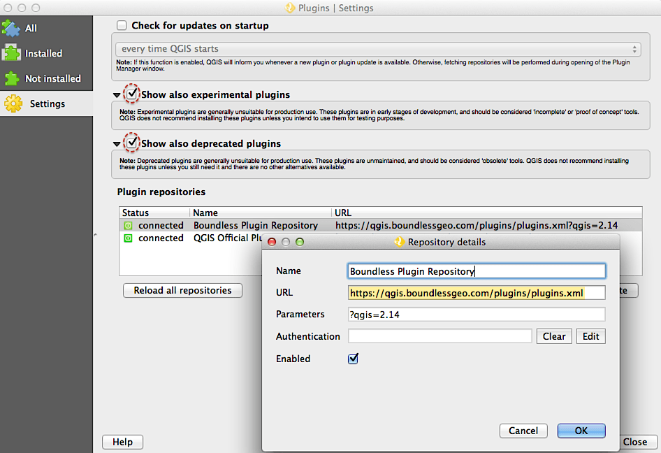

.. (c) 2016 Boundless, http://boundlessgeo.com
   This code is licensed under the GPL 2.0 license.

Boundless QGIS Plugin Repository
================================

QGIS's functionality can be remarkably extended by the use of plugins.

This is the QGIS plugin repository for Boundless_ plugins that are not in the
`official QGIS repository`_.

Using the repository in QGIS
----------------------------

If you are using `Boundless Desktop`, this repository should be already available in its QGIS along with the `Boundless Connect plugin`_. Otherwise, if you are using QGIS from one of the community's installers, you can setup this repository in the `Plugin manager` by going to :menuselection:`Plugins --> Manage and install plugins` and, in the :guilabel:`Settings` tab, add a new repository with the following URL:

- https://qgis.boundlessgeo.com/plugins/plugins.xml

.. _Boundless: http://boundlessgeo.com
.. _official QGIS repository: http://plugins.qgis.org/
.. _Boundless connect plugin: http://boundlessgeo.github.io/qgis-plugins-documentation/connect/index.html

   Adding Boundless QGIS plugin repository

.. note:: You may wish to check **Show also experimental plugins** as well as
   **Show also deprecated plugins** options. The latter is required to install the
   updated, though deprecated, version of the OpenGeo Explorer plugin.

Browsing the repository
-----------------------

- `Available plugins <https://qgis.boundlessgeo.com/plugins/plugins.xml>`_

- `Archives of released versions <https://qgis.boundlessgeo.com/plugins/packages>`_

- `Archives of secured versions <https://qgis.boundlessgeo.com/plugins/packages-auth>`_ (requires authentication)

Looking for something else?
---------------------------

- Boundless plugins in the official `QGIS plugin repository`_
- Boundless `Plugins documentation`_
- Boundless `QGIS documentation`_
- Older `OpenGeo Explorer documentation`_

.. warning:: OpenGeo Explorer is deprecated and users are recommended to migrate
   to the new `GeoServer Explorer`_ plugin.

.. _QGIS plugin repository: http://plugins.qgis.org/search/?q=boundless
.. _Plugins documentation: http://boundlessgeo.github.io/qgis-plugins-documentation
.. _QGIS documentation: http://suite.opengeo.org/opengeo-docs/qgis
.. _OpenGeo Explorer documentation: http://suite.opengeo.org/opengeo-docs/qgis/explorer
.. _GeoServer Explorer: http://plugins.qgis.org/plugins/geoserverexplorer/
